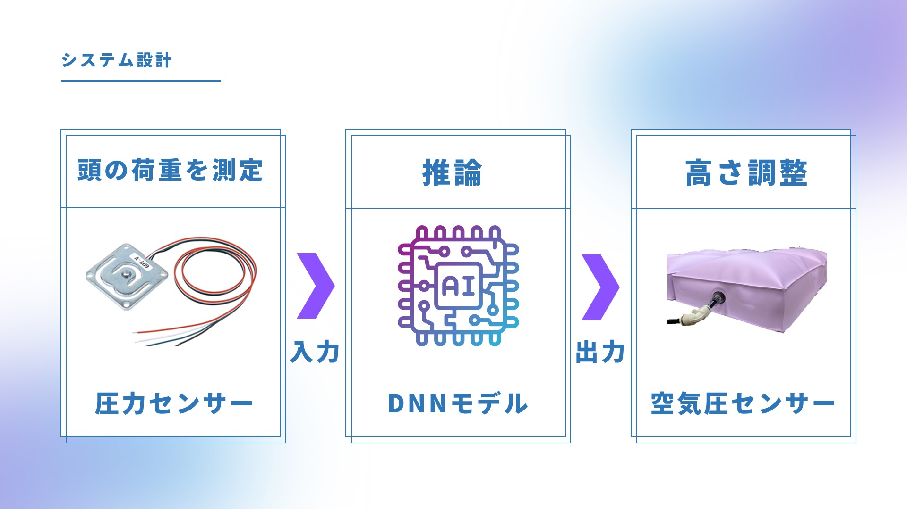

# Arduino-Python-Serial

## 使用技術一覧

<!-- シールド一覧 -->
<!-- 該当するプロジェクトの中から任意のものを選ぶ-->

  

    
    
    
    

## 目次

1. [プロジェクトについて](#プロジェクトについて)
2. [環境](#環境)
3. [開発環境構築](#開発環境構築)

<!-- プロジェクト名を記載 -->

## DCONプロジェクト

AI枕を稼働させるためのプロジェクトになります。

<!-- プロジェクトについて -->

## プロジェクトについて
Arduinoで取得した圧力データを入力データとして活用し、AIが枕の空気袋内の空気圧量を推論し、小型ポンプから膨らませることで、最終的に高さ調整を実現しております。

システム設計については、下記の通りになります。

(<a href="#top">トップへ</a>)

## 環境

<!-- 言語、フレームワーク、ミドルウェア、インフラの一覧とバージョンを記載 -->

| 言語・フレームワーク  | バージョン |
| --------------------- | ---------- |
| Python                | 3.11.9     |
| tensorflow            | 2.16.1     |
| pandas                | 2.2.1      |
| keras                 | 3.1.1      |
| numpy                 | 1.26.4     |

その他Pythonパッケージについては、requirement.txtを参照ください。

(<a href="#top">トップへ</a>)

## 開発環境構築

### venv作成と起動

以下のコマンドで仮想環境を作成できます。

python -m venv 仮想環境名

### ライブラリのインストール

以下のコマンドで仮想環境内にライブラリをインストールできます。

pip install -r for_PC/requirements.txt

(<a href="#top">トップへ</a>)
